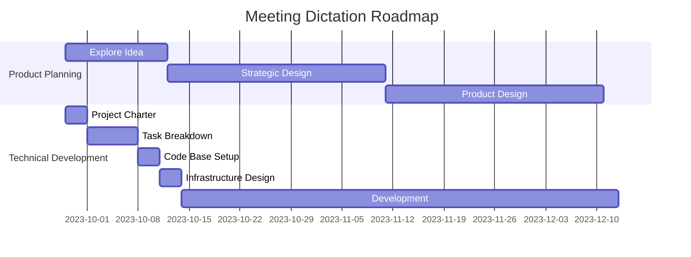

#task 
# Meeting Dictation
==THE TASK==

- [ ] Roadmap
	- [ ] Task Breakdown
	- [ ] Draft Mermaid
	- [ ] Fianalize
- [ ] Product Planning
	- [ ] Explore ideas
		- [ ] Draft
			- [ ] Market Analysis
			- [ ] Revenue Mode
		- [ ] Discuss
		- [ ] Finalize
	- [ ] Strategic Design
		- [ ] Branding
			- [ ]  Slogan
				- [ ] GPT generate
				- [ ] Editing
				- [ ] Finalize
			- [ ] Logo
				- [ ] Draft
				- [ ] Editing
				- [ ] Finalize
			- [ ] Color
				- [ ] Draft
				- [ ] Editing
				- [ ] Finalize
			- [ ] Font
				- [ ] Draft
				- [ ] Editing
				- [ ] Finalize
		- [ ] Core values
	- [ ] Product Design
		- [ ] Feature list
			- [ ] Hypothesis
			- [ ] Validate
		- [ ] User Experience Design
			- [ ] Prototyping
				- [ ] Wireframe
					- [ ] Uizard Generate
					- [ ] Validate
		- [ ] User Interface
			- [ ] Choose theme
			- [ ] Figma Design
- [ ] Technical Development
	- [ ] Project charter
		- [x] GPT generate
		- [ ] Editing
		- [ ] Finalize
	- [ ] Task Breakdown
	- [ ] Code base setup
	- [ ] Infrastructure Design
	- [ ] Development
## Roadmap

## Explore

### Draft

1. Target Audience: 
	1. Questions:
		1. Who is your target audience for this meeting SaaS product? 
		2. Are you targeting small businesses, large enterprises, specific industries, or a particular demographic?
	2. Answer: 
		1. Employee in 50+ pax company.

1. Unique Value Proposition: 
	1. Questions:
		1. What unique features or benefits will your meeting SaaS product offer? 
		2. How will it differentiate itself from existing solutions in the market?
	2. Answer: 
		1. Meeting information
		2. meeting dictation for various languages
		3. speaker identification
		4. Summarise
			1. Keywords
			2. Grouping sections
			3. Ai agenda / hidden agenda analysis
		5. action item identification
		6. sharing

1. Market Analysis: 
	1. Questions:
		1. Have you conducted market research to assess the demand for such a product? 
		2. What is the size of the market, and who are your potential competitors?
	2. Answers:
		1. i don't know what the market size is, there is only [OItter](https://otter.ai) and [Lark](https://www.larksuite.com) as competitors
		2. I want to make the product as specific as possible in this niche market

1. Revenue Model: 
	1. Questions:
		1. How do you plan to monetize your meeting SaaS product?
		2. Will it be through subscriptions, tiered pricing, or other strategies?
	2. Answers:
		1. Subscription and usage model. 
		2. Need to think on the details but the subscription include some sort of promised usage maybe.

1. Technical Requirements: 
	1. Questions:
		1. Have you considered the technical aspects of developing a meeting SaaS product?
		2. What infrastructure, hosting, and development resources will you need?
	2. Answers:
		1. infrastructure will be in microservice
		2. cloud terraform hosting in google and azure. 
		3. Tdd dev with freelance task based dev cycle. 
		4. Cicd using github workflows

### AI Feedback

Thank you for providing more details about your meeting SaaS product idea. It seems like you have a clear vision of your target audience, unique value proposition, and revenue model. Let's delve deeper into a few aspects:

1. Market Analysis: While you mentioned Otter and Lark as competitors, it's essential to conduct thorough market research to understand the size and potential of your target market. Consider factors such as the number of companies in your target audience, their willingness to adopt new meeting solutions, and their pain points with existing options. This will help you refine your product to cater specifically to their needs.

2. Differentiation: To stand out in the market, focus on the unique features and benefits your meeting SaaS product offers. The meeting dictation for various languages, speaker identification, AI agenda/hidden agenda analysis, and action item identification are all valuable features. Highlight these capabilities to showcase your product's superiority over competitors.

3. Subscription and Usage Model: To determine the specifics of your revenue model, consider factors such as the pricing tiers, the number of users or meetings included in each subscription, and any additional usage-based charges. Ensure that your pricing structure aligns with the value your product delivers and provides flexibility for different customer needs.

4. Technical Requirements: Your plan to develop your product as microservices using cloud hosting platforms like Google and Azure, along with adopting a test-driven development (TDD) approach and CI/CD using GitHub workflows, sounds solid. Make sure you have the necessary technical expertise or access to freelancers with the required skill sets to handle the development tasks effectively.

As you move forward, it's crucial to validate your product and gather feedback from potential customers in your target market. This will help you refine and tailor your offering to their specific needs, ensuring a higher chance of success.

If you have any more questions or need further guidance, feel free to ask.

## **Project Charter: Meeting Dictation Website**

**1. Project Overview:**
The purpose of this project is to develop a meeting dictation website that allows users to record, transcribe, and organize meeting notes efficiently. The website will leverage speech recognition technology to convert audio recordings into text, providing users with searchable and editable transcripts.

**2. Objectives:**
- Develop a user-friendly website accessible on desktop and mobile devices.
- Implement robust speech recognition algorithms to accurately transcribe spoken content.
- Enable seamless organization and categorization of meeting notes.
- Provide search functionality to quickly locate specific information within the transcriptions.
- Ensure data security and privacy of user recordings and transcriptions.

**3. Project Scope:**
The project scope includes the following key components:
- User interface design and development for the website.
- Integration of speech recognition technology for accurate transcription.
- Creation of a database to store audio recordings and transcriptions.
- Implementation of search functionality within the website.
- Development of user account management features.
- Testing and quality assurance to ensure website functionality and stability.

**4. Stakeholders:**
- Project Sponsor: [Name and role]
- Project Manager: [Name and contact information]
- Development Team: Stanley
- End Users: Employees in 
- IT Department: [If applicable, describe any involvement or dependencies]
- Legal and Compliance: [If applicable, describe any legal or compliance requirements]

**5. Key Deliverables:**
- Meeting dictation website with an intuitive user interface and seamless functionality.
- Speech recognition algorithms integrated into the website for accurate transcription.
- Database infrastructure for storing audio recordings and transcriptions.
- Search functionality implemented within the website.
- User account management features.
- Testing documentation and quality assurance reports.

**6. Project Constraints:**
- Budget: [Specify the allocated budget for the project]
- Timeframe: [Define the project timeline and any milestones]
- Resource Availability: [Identify any limitations in terms of personnel, equipment, or facilities]
- Technical Constraints: [Specify any technical limitations or dependencies]

**7. Risks and Mitigation Strategies:**
- Risk: Delays in speech recognition technology integration.
  Mitigation: Engage with experienced speech recognition software providers and conduct thorough testing before implementation.

- Risk: Insufficient user adoption and engagement.
  Mitigation: Conduct user research and testing throughout the development process to ensure the website meets user needs and expectations.

- Risk: Security and privacy breaches.
  Mitigation: Implement robust security measures, including encryption and user authentication, and comply with relevant data protection regulations.

**8. Project Success Criteria:**
- Successful delivery of a fully functional meeting dictation website within the specified timeframe and budget.
- High user satisfaction and engagement, based on user feedback and usage metrics.
- Accurate transcription of audio recordings with a minimum error rate.
- Positive reviews and ratings from users.

Remember to customize the project charter further based on your specific requirements and organizational standards for a meeting dictation website.

## Meeting
### Meeting 20230928

Gordon, Toby

Speaker 1: 
on9
						Speaker 2:
						eat shit

Speaker 1 Agenda:

